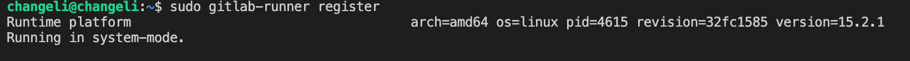

### Part 1. Настройка **gitlab-runner**

1.1 Установка gitlab-runner

1.2 Регистрация в gitlab-runner

##### Запустить **gitlab-runner** и зарегистрировать его для использования в текущем проекте (*DO6_CICD*)
- Для регистрации понадобятся URL и токен, которые можно получить на страничке задания на платформе.

### Part 2. Сборка

2.1 Содержание файла gitlab-ci.yml

### Part 3. Тест кодстайла

3.1 Содержание файла gitlab-ci.yml

### Part 4. Интеграционные тесты

4.1 Содержание файла gitlab-ci.yml

#### Написать этап для **CI**, который запускает ваши интеграционные тесты из того же проекта:

##### Запускать этот этап автоматически только при условии, если сборка и тест кодстайла прошли успешно

##### Если тесты не прошли, то "зафейлить" пайплайн

##### В пайплайне отобразить вывод, что интеграционные тесты успешно прошли / провалились

### Part 5. Этап деплоя

`-` Для завершения этого задания вы должны перенести исполняемые файлы на другую виртуальную машину, которая будет играть роль продакшена. Удачи.

**== Задание ==**

##### Поднять вторую виртуальную машину *Ubuntu Server 20.04 LTS*

#### Написать этап для **CD**, который "разворачивает" проект на другой виртуальной машине:

##### Запускать этот этап вручную при условии, что все предыдущие этапы прошли успешно

##### Написать bash-скрипт, который при помощи **ssh** и **scp** копирует файлы, полученные после сборки (артефакты), в директорию */usr/local/bin* второй виртуальной машины
*Тут вам могут помочь знания, полученные в проекте DO2_LinuxNetwork*

- Будьте готовы объяснить по скрипту, как происходит перенос.

##### В файле _gitlab-ci.yml_ добавить этап запуска написанного скрипта

##### В случае ошибки "зафейлить" пайплайн

В результате вы должны получить готовые к работе приложения из проекта *C3_SimpleBashScripts* (s21_cat и s21_grep) на второй виртуальной машине.

##### Сохранить дампы образов виртуальных машин
**p.s. Ни в коем случае не сохранять дампы в гит!**
- Не забудьте запустить пайплайн с последним коммитом в репозитории.

### Part 6. Дополнительно. Уведомления

`-` Здесь написано, что ваше следующее задание выполняется специально для нобелевских лауреатов.
Здесь не сказано, за что они получили премию, но точно не за умение работать с **gitlab-runner**.

**== Задание ==**

##### Настроить уведомления о успешном/неуспешном выполнении пайплайна через бота с именем "[ваш nickname] DO6 CI/CD" в *Telegramm*

- Текст уведомления должен содержать информацию об успешности прохождения как этапа **CI**, так и этапа **CD**.
- В остальном текст уведомления может быть произвольным.

## Chapter IV

`-` Хорошо. По завершении серии заданий сотруднику следует пройти в комнату отдыха.

Пока у вас выдалась свободная минута в комнате отдыха вы, попутно размышляя о странности происходящего, решаете проверить почту.

Не успели вы достать телефон, как в комнату отдыха зашёл ещё один человек.

`-` Привет, что-то я тебя тут раньше не видел.

`-` Было бы странно, если бы видел. Я тут первый день, хах.

`-` О, первый день! Ну и как тебе наш "босс"? - последние слова прозвучали с явной усмешкой

`-` Это был босс? Фух, всё-таки он не одному мне кажется странным... и слегка грубым? Я уж думал, что вы все в Англии такие.

`-` Ахах, ни в коем случае, друг. Это просто розыгрыш над новичками, но не волнуйся завтра всё будет в порядке. Кстати говоря, вон идет и настоящий босс, кажется к тебе. Ну удачи, свидимся еще.

Незнакомец быстро пропал и в комнату зашел невысокий мужчина в дорогом костюме, с небольшой залысиной, навскидку лет этак 50-60-ти. Не дожидаясь ваших слов, он с тонкой, едва уловимой, улыбкой произнес:

`-` Ах, Томас, видимо это вы. Поистине великолепное выполнение тестовой работы. Надеюсь вы не испугались нашей милой подруги ASI младшей, она высоко отозвалась о вас. Итак, позвольте мне подробнее рассказать чем мы тут вообще занимаемся и какова ваша роль в нашей компании...
